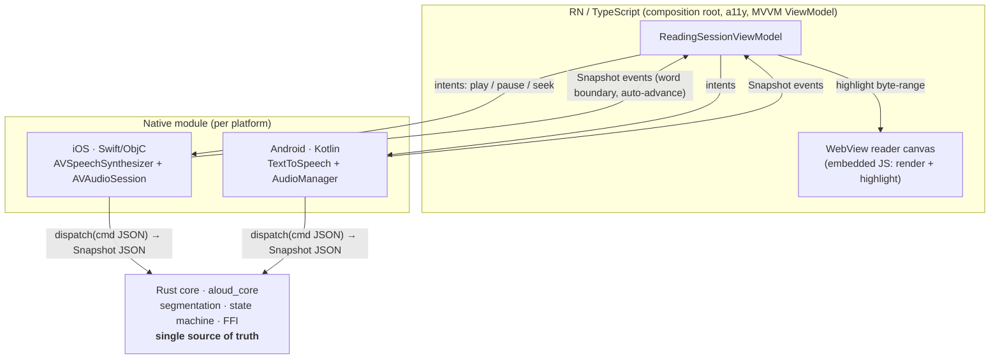

# Aloud 🔊

**An accessible, cross-platform read-aloud reader — RN/TypeScript ⇄ WebView ⇄ Swift ⇄ Kotlin ⇄ a shared Rust core.**

Aloud reads articles out loud and highlights each word as it is spoken. It is a
small product with a deliberately demanding architecture: a single feature — "say
this sentence and light up the word" — touches **all five layers** the way a real
cross-platform app does, and does it with accessibility as a first-class outcome.

> This repository is a worked example built to demonstrate a specific way of
> working: a shared systems-language core, a contract-first FFI boundary, and
> accessibility and testing treated as part of "done" rather than clean-up.

---

## Why this architecture (the 30-second version)

| The hard part of cross-platform mobile | How Aloud answers it |
|---|---|
| A feature spans JS ↔ native ↔ Rust, and **a signature mismatch is a runtime crash, not a compile error** | The FFI is **5 C functions that never grow**; features are JSON **commands** validated by a shared schema + [contract tests](contracts/) in every language |
| Reading logic gets **re-implemented and drifts** across iOS/Android/JS | Position, segmentation and highlight math live **once**, in a tested [Rust core](core/); every layer renders the same `Snapshot` |
| Per-vendor audio/speech quirks | iOS `NSRange` and Android `onRangeStart` both report **UTF-16** offsets; the core owns the **UTF-16→UTF-8** conversion in one place ([tested](core/src/segmentation.rs)) |
| Accessibility bolted on last | Screen-reader coordination, focus management and announcement politeness are [designed in](docs/accessibility.md) and unit-tested |
| Debugging across four log streams | A [correlation trace id](docs/debugging-across-the-stack.md) threads JS → native → Rust → WebView |
| Messy git history | Atomic cross-layer commits, one branch per task, [reviewable PRs](docs/testing-strategy.md#git--review-discipline) |

Full reasoning: [`docs/architecture.md`](docs/architecture.md) and the
[ADRs](docs/adr/).

## The five layers



The native module — not JS — runs the tight word-boundary loop, because those
callbacks fire dozens of times per second on the audio thread. JS sends coarse
intents and renders `Snapshot`s streamed up from native. See
[ADR-0003](docs/adr/0003-native-owns-the-boundary-loop.md).

## Repository layout

```
core/        Rust shared engine (aloud_core) — segmentation, state machine, C ABI + tests
contracts/   The one FFI contract: C header, JSON schema, shared fixtures, parity strategy
app/         RN/TypeScript — MVVM ViewModel, a11y, WebView canvas, native port + tests
ios/         Swift/ObjC native module (TTS + audio session + bridging macros)
android/     Kotlin native module (TextToSpeech + audio focus + JNA binding)
e2e/         Device E2E flow (Maestro) for the read-aloud path
docs/        Architecture, ADRs, diagrams, accessibility, debugging, testing
```

## Build & test

Everything that can be verified without a device toolchain is wired into CI and
runs locally:

```bash
# Rust core — 23 unit + integration tests
cargo test --manifest-path core/Cargo.toml

# TypeScript — ViewModel + cross-language contract tests
cd app && npm ci && npm test && npm run typecheck
```

The native iOS/Android builds and the Maestro E2E flow run on their respective
device toolchains; the Rust core, its C header, the Swift/Kotlin modules and the
JS are all present and reviewed here. See each layer's README for the
`xcframework` / `cargo-ndk` packaging steps.

## What to read first (for a reviewer)

1. [`docs/architecture.md`](docs/architecture.md) — the whole picture and the reasoning.
2. [`contracts/README.md`](contracts/README.md) — how four languages stay in sync.
3. [`core/src/state_machine.rs`](core/src/state_machine.rs) — the reducer that is the source of truth.
4. [`docs/accessibility.md`](docs/accessibility.md) — a11y as a definition-of-done.
5. The [pull requests](../../pulls?q=is%3Apr) — how the work was sequenced and reviewed.

## License

MIT — see [LICENSE](LICENSE).
