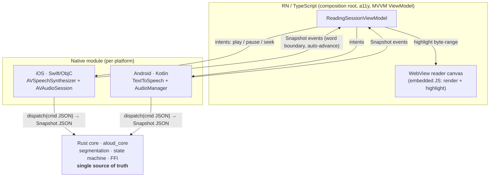

# Aloud 🔊

**An accessible, cross-platform read-aloud reader — RN/TypeScript ⇄ WebView ⇄ Swift ⇄ Kotlin ⇄ a shared Rust core.**

Aloud reads articles out loud and highlights each word as it is spoken. It is a
small product with a deliberately demanding architecture: a single feature — "say
this sentence and light up the word" — touches **all five layers** the way a real
cross-platform app does, and does it with accessibility as a first-class outcome.

> This repository is a worked example built to demonstrate a specific way of
> working: a shared systems-language core, a contract-first FFI boundary, and
> accessibility and testing treated as part of "done" rather than clean-up.

---

## Why this architecture (the 30-second version)

| The hard part of cross-platform mobile | How Aloud answers it |
|---|---|
| A feature spans JS ↔ native ↔ Rust, and **a signature mismatch is a runtime crash, not a compile error** | The FFI is **5 C functions that never grow**; features are JSON **commands** validated by a shared schema + [golden fixtures](contracts/) that **all four bindings execute against the same bytes** — Rust over the real C ABI, TypeScript against the schema, Swift and Kotlin against their native structs, every one of them in CI |
| Reading logic gets **re-implemented and drifts** across iOS/Android/JS | Position, segmentation and highlight math live **once**, in a tested [Rust core](core/); every layer renders the same `Snapshot` |
| Per-vendor audio/speech quirks | iOS `NSRange` and Android `onRangeStart` both report **UTF-16** offsets; the core owns the **UTF-16→UTF-8** conversion in one place ([tested](core/src/segmentation.rs)) |
| Accessibility bolted on last | Screen-reader coordination, focus management and announcement politeness are [designed in](docs/accessibility.md) and unit-tested |
| Debugging across four log streams | A [correlation trace id](docs/debugging-across-the-stack.md) threads JS → native → Rust → WebView |
| Messy git history | Atomic cross-layer commits, one branch per task, [reviewable PRs](docs/testing-strategy.md#git--review-discipline) |

Full reasoning: [`docs/architecture.md`](docs/architecture.md) and the
[ADRs](docs/adr/).

## Run it

### Fastest path: no mobile toolchain at all
The reading engine is a plain Rust crate — you can watch it segment a document,
track reading position, and highlight words (including a multibyte "Café
música" sentence, proving the UTF-16→UTF-8 mapping live) with nothing but
`cargo`:

```bash
git clone git@github.com:Ouraborus/aloud.git && cd aloud
cargo run --example read_aloud --manifest-path core/Cargo.toml
```

### The real app, on the iOS Simulator
This is an npm workspace: `@aloud/app` (the engine) and `@aloud/aloud-tts` (the
native module) are real, autolinked packages — not files copied into a demo
project — and [`example/`](example/) is a runnable host app that depends on
both.

```bash
npm install                          # installs the whole workspace at once
npm run build:core:ios               # cross-compiles core/ -> an xcframework
cd example/ios && pod install && cd ../..
npm run example:ios                  # boots the simulator and launches the app
```

CocoaPods discovers `@aloud/aloud-tts` on its own via standard RN autolinking
(`use_native_modules!` in `example/ios/Podfile`) — nothing is wired into Xcode
by hand. See [`native/aloud-tts/`](native/aloud-tts/) for how that's set up,
and [`example/README.md`](example/README.md) for the Android path and
troubleshooting.

## The five layers



The native module — not JS — runs the tight word-boundary loop, because those
callbacks fire dozens of times per second on the audio thread. JS sends coarse
intents and renders `Snapshot`s streamed up from native. See
[ADR-0003](docs/adr/0003-native-owns-the-boundary-loop.md).

## Repository layout

This is an **npm workspace** — `app/`, `native/aloud-tts/` and `example/` are
real local packages (symlinked into `node_modules` by `npm install`), not
copies of each other.

```
core/               Rust shared engine (aloud_core) — segmentation, state machine, C ABI + tests
contracts/          The one FFI contract: C header, JSON schema, shared fixtures, parity strategy
app/                @aloud/app — RN/TypeScript engine: MVVM ViewModel, a11y, WebView canvas, native port + tests
native/aloud-tts/   @aloud/aloud-tts — the autolinked native module (Swift/ObjC + Kotlin) + build scripts' outputs
example/            @aloud/example — a runnable host app: depends on the two packages above like any consumer would
scripts/            build-ios-core.sh / build-android-core.sh — compile core/ into what native/aloud-tts vendors
e2e/                Device E2E flow (Maestro) for the read-aloud path
docs/               Architecture, ADRs, diagrams, accessibility, debugging, testing
```

## Build & test

Everything that can be verified without a device toolchain is wired into CI and
runs locally:

```bash
# Rust core — 35 unit + integration + invariant tests
cargo test --manifest-path core/Cargo.toml

# TypeScript engine — ViewModel + contract + WebView-canvas tests (plain Node, no device)
npm install && npm test --workspace=app

# The RN shell (screen, hook, native adapter) type-checks against the real
# react-native peers that example/ supplies — still no emulator required.
npm run typecheck --workspace=example
```

## What's actually verified vs. reviewed-but-not-compiled

Being precise about this matters more than claiming everything works. CI is
split in two: a **fast path** that gates every push (Rust, TypeScript, and the
Swift/Kotlin contract tests — all hermetic, under a minute), and a
**device-toolchain** workflow that cross-compiles the core for each platform and
builds the native modules against the real artifact.

| Layer | Status |
|---|---|
| Rust core (`core/`) | **Compiles, 35 tests pass**, on every push (CI) |
| TypeScript engine (`app/`) | **Compiles, 37 tests pass, typechecks**, on every push (CI) — including the WebView canvas, driven through its real message protocol in JSDOM |
| RN shell (`ReaderScreen`, hook, native adapter) | **Type-checked in CI** against the real react-native peers via `example/`; not unit-tested (no renderer in the fast path) |
| iOS native module + xcframework (`native/aloud-tts/ios/`) | **Fully built in CI**: the xcframework is cross-compiled for three Apple targets and the app is built against it with `xcodebuild`; **7 contract tests pass** (`swift test`, no simulator). Also run on the iOS Simulator during development |
| Android native module (`native/aloud-tts/android/`) | **Fully built in CI**: `cargo-ndk` cross-compiles the core for all three ABIs and `./gradlew assembleDebug` autolinks and compiles the Kotlin module against them; **5 contract tests pass** (JVM `gradle test`, no SDK or emulator). Not run on a physical device or emulator |
| Maestro E2E (`e2e/`) | **Runs in CI** against a **Release** build on a booted iOS simulator (`e2e-ios`), asserting the load → step → play → pause path end to end. No Android emulator run yet |

See each layer's own README for exact commands and caveats.

## What to read first (for a reviewer)

1. [`docs/architecture.md`](docs/architecture.md) — the whole picture and the reasoning.
2. [`contracts/README.md`](contracts/README.md) — how four languages stay in sync.
3. [`core/src/state_machine.rs`](core/src/state_machine.rs) — the reducer that is the source of truth.
4. [`docs/accessibility.md`](docs/accessibility.md) — a11y as a definition-of-done.
5. The [pull requests](../../pulls?q=is%3Apr) — how the work was sequenced and reviewed.

## License

MIT — see [LICENSE](LICENSE).
