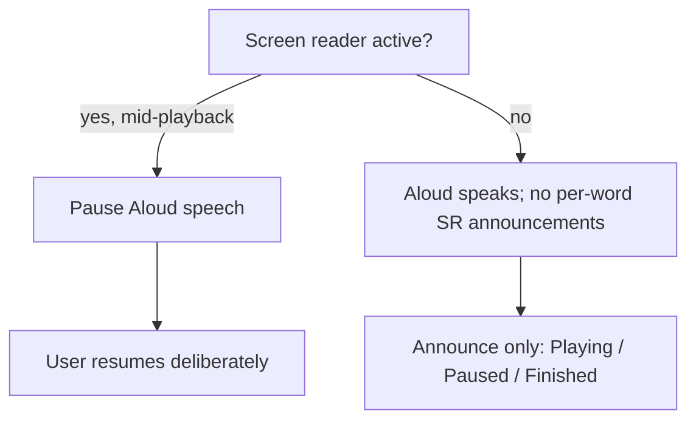

# Accessibility

Screen-reader users are core users of Aloud. This document is the definition of
done for accessibility and the WCAG mapping we hold features to. The *why* is in
[ADR-0004](adr/0004-accessibility-strategy.md); this is the practical checklist.

## The central tension: two speech sources

Aloud speaks, and so does VoiceOver/TalkBack. The whole a11y design is about the
two not colliding:

- We **never** emit per-word screen-reader announcements during playback (that
  would talk over our own audio). Only coarse transitions are announced. This is
  a pure function, unit-tested in
  [`announce.ts`](../app/src/a11y/announce.ts).
- iOS `AVAudioSession` mode is `.spokenAudio`; Android output is
  `CONTENT_TYPE_SPEECH` — both tell the OS "this is speech", so it coexists with
  the screen reader rather than ducking it.
- If the screen reader turns on mid-playback, we pause (native observers on
  `voiceOverStatusDidChangeNotification` / `isTouchExplorationEnabled`).

## WCAG 2.1 mapping (target: AA)

| Guideline | How Aloud meets it |
|---|---|
| 1.1.1 Non-text content | Every control has an `accessibilityLabel`; the highlight is decorative and marked so |
| 1.3.1 Info & relationships | Controls expose `accessibilityRole`; progress uses `role=adjustable` with a value |
| 1.4.3 Contrast (AA) | Highlight and text meet ≥ 4.5:1 in both light and dark themes (see `reader.html` tokens) |
| 1.4.11 Non-text contrast | Focus/selection indicators meet ≥ 3:1 |
| 2.1.1 Keyboard / switch | All actions reachable via accessibility actions (increment/decrement, activate) |
| 2.4.3 Focus order | After load, focus moves to the primary action; the WebView is removed from the a11y tree |
| 2.5.5 Target size | Controls are ≥ 44×44 pt (play button 64 pt; `hitSlop` on secondary controls) |
| 4.1.2 Name/role/value | `accessibilityState` reports `disabled`/`busy`; state changes are announced with correct politeness |

## Definition of done (per feature)
- [ ] Every new control has role + label + state.
- [ ] No new code announces during active playback.
- [ ] Announcement politeness chosen deliberately (assertive only for
      completion/errors).
- [ ] Focus lands somewhere sensible after any navigation.
- [ ] Contrast verified in light **and** dark.
- [ ] Manually verified with **VoiceOver on a physical iPhone** and **TalkBack on
      a physical Android device** — simulators do not reproduce audio-session
      interactions faithfully.

## Manual device test script
1. Turn on VoiceOver/TalkBack. Launch Aloud.
2. Confirm focus lands on Play; label reads "Play".
3. Activate Play. Confirm a single "Playing" announcement, then silence from the
   screen reader while Aloud speaks.
4. Swipe up/down on the progress row → next/prev sentence; confirm the landed
   sentence is announced only when paused.
5. Reach the end → confirm one assertive "Finished reading".
6. Mid-playback, toggle the screen reader off/on → confirm Aloud pauses on.
