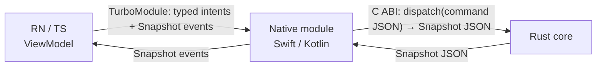
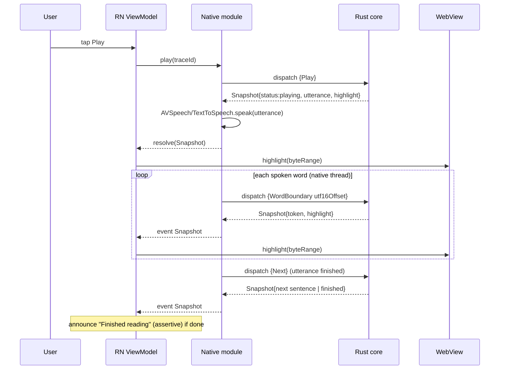
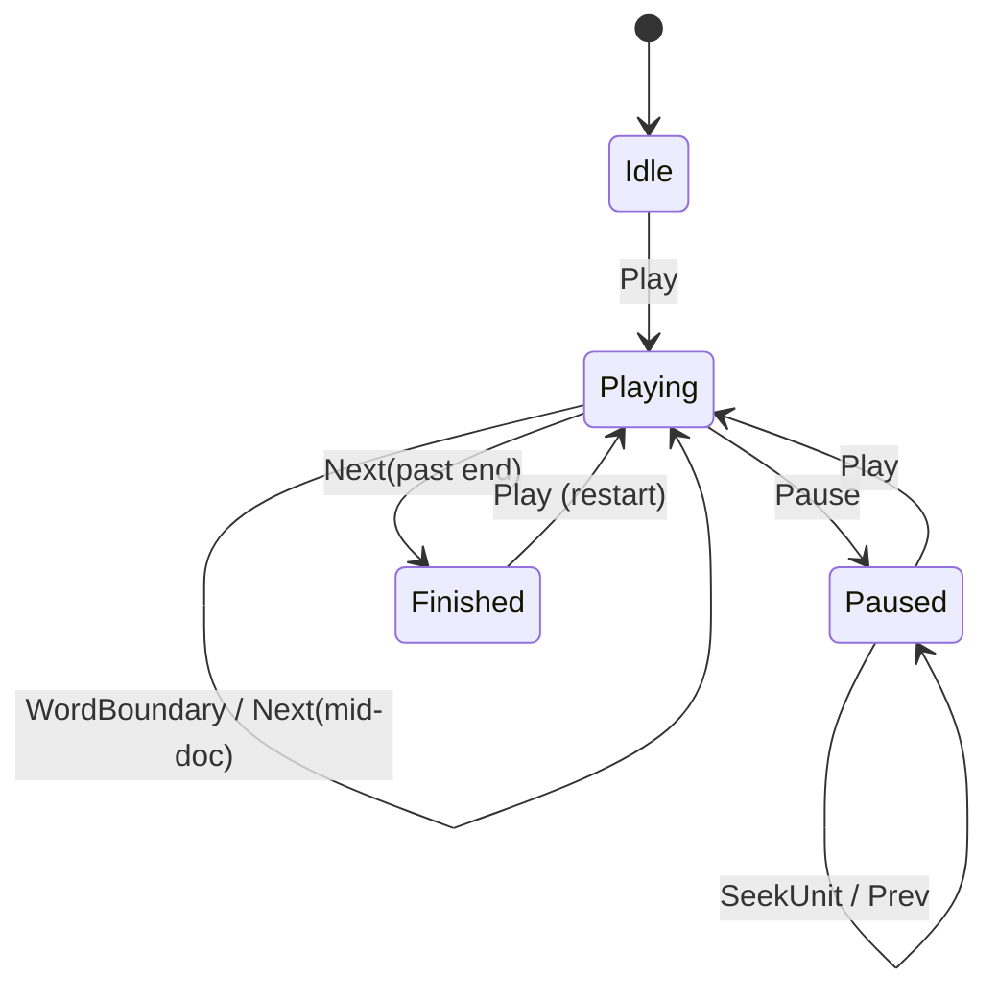

# Architecture

Aloud is built around one idea: **put the hard, easily-divergent logic in one
tested place, and make the boundaries between languages impossible to drift
silently.** Everything below follows from that.

## 1. Layers and responsibilities

| Layer | Language | Owns | Explicitly does NOT own |
|---|---|---|---|
| Core | Rust | Segmentation, reading position, highlight math, UTF-16→UTF-8 | Any I/O, audio, drawing, logging sinks |
| Native module | Swift / Kotlin | Audio session, TTS engine, word-boundary loop, screen-reader coordination | Reading position (asks the core) |
| WebView canvas | JS | Rendering the article, painting the highlight span, reporting taps | Tokenisation, position |
| RN app | TypeScript | Composition, MVVM ViewModel, accessibility, orchestration | Reading logic (delegates to core via native) |

This is **hexagonal / ports-and-adapters**: the Rust core is the domain, and the
native + JS layers are adapters. The "port" is the FFI, and it is intentionally
tiny (see [ADR-0002](adr/0002-contract-first-ffi.md)).

## 2. The two boundaries

There are exactly two places where languages meet, and each is pinned by the
same JSON `Snapshot`/`Command` shapes ([`contracts/`](../contracts/)):

- **RN ↔ native**: a TurboModule with typed intents and a `Snapshot` event stream.
- **native ↔ Rust**: the 5-function C ABI; everything meaningful is JSON `dispatch`.

Both boundaries carry the identical `Snapshot`, so the schema in
[`commands.schema.json`](../contracts/commands.schema.json) validates the whole
chain, and the [contract tests](../contracts/README.md) fail CI on drift.

## 3. The read-aloud sequence (the feature that touches everything)

Notice the word-boundary loop stays between **native and Rust**; JS is only
notified of the resulting snapshot. That keeps the highlight in lock-step with
the audio without a JS round-trip per word ([ADR-0003](adr/0003-native-owns-the-boundary-loop.md)).

## 4. The reducer at the center

The core is a pure reducer: `dispatch(Command) -> Snapshot`. No hidden state
lives in any other layer, so there is nothing to keep in sync besides the
snapshot itself. This is what makes MVVM viable *without* duplicating logic per
platform ([ADR-0006](adr/0006-mvvm-over-shared-core.md)): each ViewModel is a
thin pass-through over the shared reducer.

## 5. Cross-cutting concerns

- **Accessibility** is a design input, not a pass at the end — see
  [`accessibility.md`](accessibility.md).
- **Observability**: one trace id per user intent, threaded through every layer —
  see [`debugging-across-the-stack.md`](debugging-across-the-stack.md).
- **Testing** at every layer, with the expensive device tests kept few and
  focused — see [`testing-strategy.md`](testing-strategy.md).

## 6. Decision records

| ADR | Decision |
|---|---|
| [0001](adr/0001-rust-shared-core.md) | A shared Rust core owns reading logic |
| [0002](adr/0002-contract-first-ffi.md) | A tiny, JSON-command FFI instead of a wide typed one |
| [0003](adr/0003-native-owns-the-boundary-loop.md) | The word-boundary loop runs native-side |
| [0004](adr/0004-accessibility-strategy.md) | Accessibility strategy & definition of done |
| [0005](adr/0005-cross-layer-tracing.md) | Correlated trace ids across layers |
| [0006](adr/0006-mvvm-over-shared-core.md) | MVVM presentation over the shared core |
