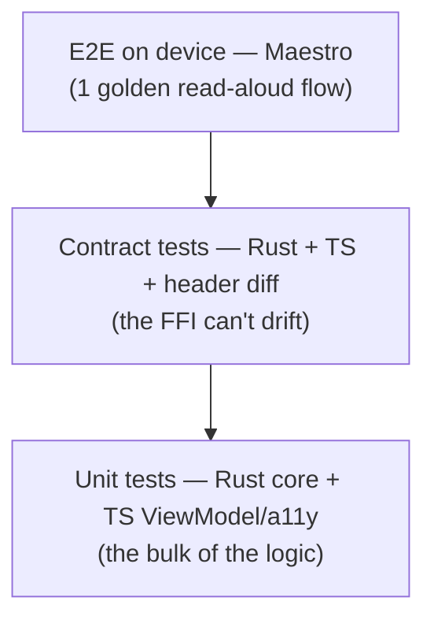

# Testing strategy

The guiding rule: **push each check to the cheapest layer that can catch it.**
Most of what can break lives in the Rust core and the ViewModel, and both are
tested off-device in milliseconds. Device tests are few and reserved for what
*only* a device can prove.

## The pyramid



| Level | Tooling | Runs in CI here | Proves |
|---|---|---|---|
| Core unit + integration | `cargo test` | ✅ | Segmentation, state machine, UTF-16→UTF-8, FFI round-trip (23 tests) |
| JS unit | `vitest` | ✅ | ViewModel transitions, a11y announcement policy (18 tests) |
| Contract parity | `vitest` + `cargo test` + `cbindgen` diff | ✅ | TS/Rust/C header all agree with `commands.schema.json` |
| Native unit | XCTest / JUnit | on device toolchain | Swift/Kotlin decode the shared fixtures; audio-session transitions |
| E2E | Maestro | on device toolchain | The real read-aloud path end to end (see [`e2e/`](../e2e/)) |

## What each layer's tests deliberately cover
- **Core** owns the logic, so it owns the *most* tests, including the tricky
  multibyte boundary case (`boundary_math_survives_multibyte_text`).
- **Contract tests** are the anti-drift net: the same golden fixtures
  ([`fixtures.json`](../contracts/fixtures.json)) are asserted in Rust and TS, and
  the C header is diffed against the real exported symbols.
- **ViewModel tests** use a fake `AloudTts` port, so they cover the a11y policy
  and state derivation with no device.
- **E2E** is intentionally a single, stable golden flow — enough to catch a dead
  bridge or broken wiring, not a maze of flaky device tests.

## Git & review discipline
The offer asks for "atomic commits for cross-layer changes, clean per-task
branches, reviews that stay tractable." How this repo does it:

- **One branch per task**, named `feat/…`, `docs/…`, `ci/…`; each maps to a
  tracking issue.
- **Atomic cross-layer commits**: when a feature crosses layers (e.g. `SeekByte`
  touches Rust + contract + TS + Swift + Kotlin + WebView), it lands as *one*
  commit so the boundary is never half-updated in history. See the
  [pull requests](../../../pulls?q=is%3Apr) for the sequencing.
- **Reviewable PRs**: each PR body states the layers touched, the contract
  impact, and the test evidence, and follows
  [`.github/pull_request_template.md`](../.github/pull_request_template.md).

## Running everything locally
```bash
cargo test --manifest-path core/Cargo.toml
cd app && npm ci && npm test && npm run typecheck
```
